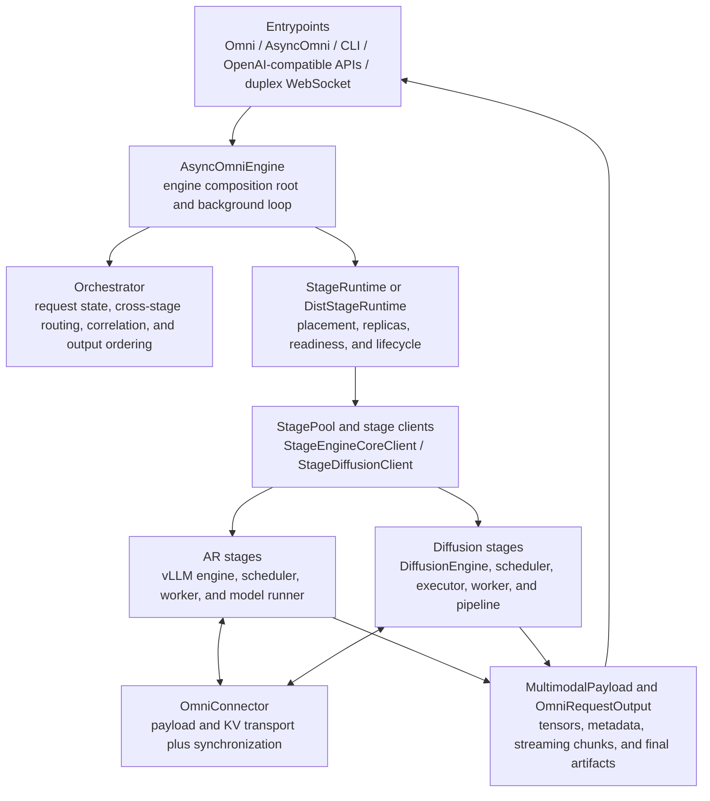
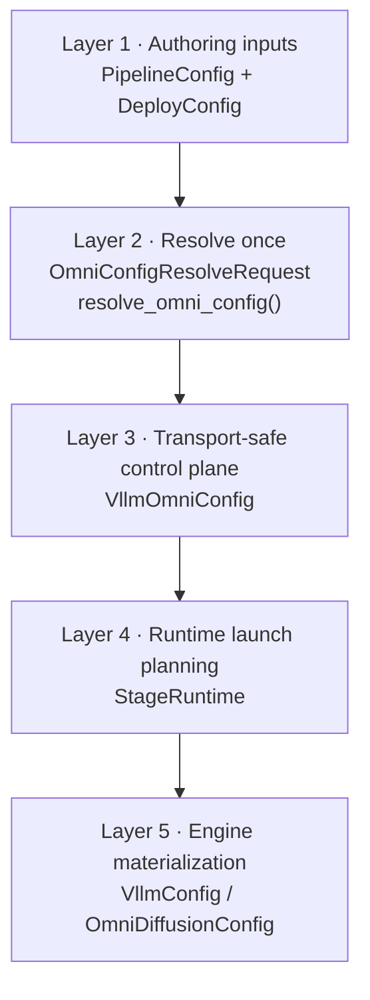
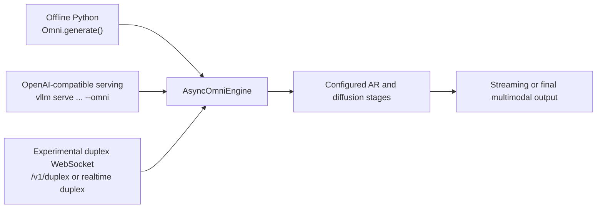

# Architecture Overview

This document outlines the architecture of vLLM-Omni.

<p align="center">
  <picture>
    <source media="(prefers-color-scheme: dark)" src="https://raw.githubusercontent.com/vllm-project/vllm-omni/refs/heads/main/docs/source/architecture/omni-modality-model-architecture.png">
    
  </picture>
</p>

## Design goals

The primary goal of vLLM-Omni is to provide a fast and easy-to-use inference
and serving engine for omni-modality models. vLLM-Omni extends vLLM's
text-oriented autoregressive (AR) runtime with stage-based execution for
non-textual outputs and non-autoregressive model components.

The architecture is designed to:

* support text, image, audio, video, and action inputs and outputs;
* compose autoregressive, generation, and diffusion stages in one pipeline;
* reuse vLLM scheduling, cache, distributed-execution, and serving
  primitives where they fit; and
* keep model topology, deployment placement, runtime lifecycle, transport,
  and public API concerns in separate layers.

## Model execution topologies

vLLM-Omni is not limited to one model graph. A registered `PipelineConfig`
defines the stages and their relationships, while `DeployConfig` supplies the
placement and runtime choices for a particular deployment.

| Topology | Representative examples | Runtime shape |
| --- | --- | --- |
| AR plus downstream generation or diffusion | Qwen3-Omni, Qwen3-TTS, MiniCPM-o 4.5 | An AR stage produces text, codes, or conditioning for one or more downstream stages. |
| Diffusion-first generation | Qwen-Image, FLUX, HunyuanImage3, Cosmos3, Krea 2 | A diffusion stage owns denoising and may use an auxiliary text or multimodal encoder. |
| Joint multimodal generation | MiniMax H3, LTX-2 | A pipeline combines multiple model components to produce synchronized or multimodal artifacts such as video and audio. |
| Stateful or full-duplex interaction | MiniCPM-o 4.5 and experimental world-model paths | The runtime keeps session-scoped state and supports streaming, cancellation, or incremental input. |

The following illustrations show common model-level arrangements. They are
examples of model topology, not constraints on the runtime.

### DiT as the main structure, with AR as an encoder

For example, Qwen-Image uses an AR or text-encoding component to condition a
diffusion transformer.

<p align="center">
  <picture>
    <source media="(prefers-color-scheme: dark)" src="https://raw.githubusercontent.com/vllm-project/vllm-omni/refs/heads/main/docs/source/architecture/dit-main-architecture.png">
    
  </picture>
</p>

### AR as the main structure, with a diffusion generator

For example, BAGEL uses an AR model for multimodal understanding and text
reasoning, with a diffusion component for visual generation.

<p align="center">
  <picture>
    <source media="(prefers-color-scheme: dark)" src="https://raw.githubusercontent.com/vllm-project/vllm-omni/refs/heads/main/docs/source/architecture/ar-main-architecture.png">
    
  </picture>
</p>

### AR and DiT in one multimodal pipeline

For example, Qwen-Omni combines multimodal encoders, an AR language model,
and a modality generator.

<p align="center">
  <picture>
    <source media="(prefers-color-scheme: dark)" src="https://raw.githubusercontent.com/vllm-project/vllm-omni/refs/heads/main/docs/source/architecture/ar-dit-main-architecture.png">
    
  </picture>
</p>

## System architecture

The runtime is organized around an engine, an orchestrator, stage lifecycle
management, and independent AR and diffusion stage implementations.



### Key components

| Component | Responsibility |
| --- | --- |
| **Entrypoints** | Translate offline, CLI, OpenAI-compatible, and duplex requests into engine operations and render outputs back to public protocols. |
| **Configuration resolution** | Combines pipeline topology, deployment settings, model metadata, and user overrides into a validated control-plane configuration. |
| **AsyncOmniEngine** | Owns engine composition, the background event loop, stage initialization, request submission, and output collection. |
| **Orchestrator** | Owns cross-stage request state, stage-to-stage routing, companion tracking, correlation, cancellation, and output ordering. It does not own model selection or deployment placement. |
| **StageRuntime** | Expands logical stages into local or distributed replicas, starts stage clients and processes, and manages readiness, affinity, failure, and shutdown. |
| **AR runtime** | Extends vLLM's scheduler, KV-cache, worker, and model-runner path for omni-modality inputs and inter-stage outputs. |
| **Diffusion runtime** | Schedules and executes denoising workloads through diffusion executors, workers, pipelines, acceleration backends, and output materialization. |
| **OmniConnector** | Transports stage payloads and KV-cache data and provides synchronization. Connectors transport data; they do not choose the next logical stage. |
| **Multimodal outputs** | `MultimodalPayload` separates tensor content from metadata, while `OmniRequestOutput` carries pipeline and diffusion results through the common output path. |

## Configuration and runtime resolution

The control plane has five conceptual layers. Authoring inputs are resolved
once into a complete, transport-safe configuration before runtime processes are
started. This keeps stage topology and model capabilities distinct from
deployment placement and from process-local engine objects.

The figure shows only the primary hand-off object for each layer; the detailed
inputs, fields, and ownership rules are described below.



The resolver names in this diagram describe the intended single resolution
boundary. In the current implementation, the corresponding path is carried
out by `StageConfigFactory.create_from_model()` and
`VllmOmniConfig.from_pipeline_config()` in
[`vllm_omni/config`](https://github.com/vllm-project/vllm-omni/tree/main/vllm_omni/config).
The legacy `stage_args` YAML path remains only for models that have not yet
migrated to `PipelineConfig` and `DeployConfig`.

In the typed path, the common `VllmOmniStageConfig` slot in the
diagram is realized by `VllmOmniARStageConfig`,
`VllmOmniGenerationStageConfig`, or `VllmOmniDiffusionStageConfig`. The
request and engine-spec fields belong to the control-plane boundary; the
current implementation stores their equivalent projections in the structured
stage configuration and materializes backend-specific engine objects during
stage initialization.

The important ownership rules are:

1. `PipelineConfig` is the source of truth for stage topology, execution type,
   model capabilities, and stage relationships.
2. `DeployConfig` describes placement, replicas, devices, connectors, and
   deploy-time defaults; it does not redefine the model graph.
3. CLI and Python overrides are applied at the resolution boundary, with
   per-stage overrides taking precedence over global values where supported.
4. `StageRuntime` owns launch planning and replica lifecycle. `ReplicaInitPlan`
   is runtime-private state, not a user configuration object.
5. `VllmConfig` and the enriched `OmniDiffusionConfig` are materialized in the
   process that owns the corresponding engine.

## Main features

### Stage-based execution and disaggregation

Each logical stage declares its inputs, outputs, execution type, and connector
edges. The orchestrator routes requests according to those declared
relationships, while `OmniConnector` implementations move data or KV-cache
payloads across processes, devices, or nodes. Qwen3-Omni, for example, can
represent Thinker, Talker, and Code2Wav as separate stages.

### AR and diffusion acceleration

The two runtime families share the stage and output contracts while retaining
their specialized execution paths:

* **AR stages:** vLLM scheduling, KV-cache management, batching, CUDA Graphs,
  and model-runner optimizations.
* **Diffusion stages:** continuous batching, compile granularity, cache
  acceleration, attention backends, quantization, CPU or layerwise offload,
  tensor/sequence/CFG/VAE parallelism, and distributed layerwise offload.

### Classifier-Free Guidance companion flow

CFG can be represented as companion requests that share the parent request's
stage affinity and transport lifecycle:

1. A model-provided `prompt_expand_func` expands the initial prompt into a
   primary request and one or more companion requests.
2. The `Orchestrator` tracks parent/companion identities and waits for the
   required stage outputs. The connector transfers the associated KV-cache
   payloads across the stage boundary.
3. A downstream diffusion stage invokes its `cfg_kv_collect_func` to collect
   companion KV data and apply model-specific guidance inputs.

See [CFG parallelism](feature/cfg_parallel.md) for the diffusion-side
configuration and constraints.

### Distributed inference and memory efficiency

The deployment layer can combine stage replicas with vLLM parallelism and
diffusion parallelism. Composable strategies make common layouts reusable,
while CPU offload, layerwise offload, and distributed layerwise offload allow
large diffusion pipelines to run under tighter device-memory budgets.

### Extensibility

New model families contribute a pipeline definition, stage implementations,
input/output adapters, and optional acceleration or connector integrations.
The central engine and orchestrator remain model-agnostic; model-specific
behavior is selected by resolved stage metadata and explicit extension hooks.

## Interfaces

The public interfaces map onto the same engine and stage boundaries:



### Offline inference

The **Omni** class provides a Python interface for offline batched inference:

```python
from vllm_omni.entrypoints.omni import Omni

omni = Omni(model="Qwen/Qwen3-Omni-30B-A3B-Instruct")

om_inputs = {
    "prompt": prompt,
    "multi_modal_data": {
        "video": video_frames,
        "audio": audio_signal,
    },
}

outputs = omni.generate(om_inputs, sampling_params_list)
```

### Online serving

The OpenAI-compatible server uses the same stage configuration and engine
boundaries:

```bash
vllm serve Qwen/Qwen3-Omni-30B-A3B-Instruct --omni --port 8091
```

For example, a Qwen3-Omni chat request can contain text, image, audio, or
video content and a `sampling_params_list` for its configured stages. See the
[Qwen3-Omni serving example](../user_guide/examples/online_serving/qwen3_omni.md)
and the [examples](https://github.com/vllm-project/vllm-omni/tree/main/examples)
for complete requests.

Some pipelines expose additional OpenAI-compatible endpoints, such as joint
video/audio generation. Endpoint support remains model-specific; consult the
relevant model guide before assuming that every OpenAI route applies to every
pipeline.
