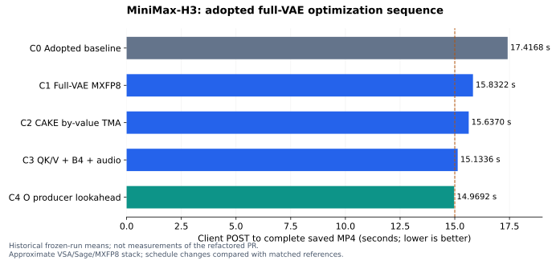

# MiniMax-H3 Ultra

MiniMax-H3 Ultra combines FastH3 VSA, Sage attention, MXFP8 projections,
communication overlap, and full video/audio VAE decoding in one E2E path.
The existing [MiniMax-H3 recipe](MiniMax-H3.md) covers checkpoint access and
standard serving.

**Integration status:** this recipe accompanies a draft port to current
vLLM-Omni. The frozen implementation completed the workload below in
**14.9692 seconds**. The current PR's public FlashInfer API integration and
shared helpers require a fresh GPU correctness and E2E qualification before
this number can be attributed to the PR commit.

## Workload and supported scope

The recorded workload uses eight SM120 GPUs with approximately 72 GiB memory
per device, four physical ConnectX-8 NIC groups, TP1/Ulysses8/ring1 for the
DiT, TP8 for the encoder, and eight-way VAE tile parallelism. It generates
362 frames at 24 fps with stereo 32 kHz audio. A 1280x720 request produces
1280x704 frames under H3's native spatial geometry.

Use one request at a time, the `vsa-datafree` FastH3 adapter, four denoiser
evaluations, top-k 162, and resident weights. The current overlap adapter is
bounded to the recorded geometry: 11,992 local rows, 95,936 aligned sequence
rows, and four reverse-projection chunks. Other prompt geometries, batch
sizes, resolutions, GPU counts, and two-NIC deployments are not qualified.
The shared Sage and MXFP8 helpers do not encode these H3 scheduling constants.

## Dependencies

Install vLLM-Omni from this PR with the vLLM version required by its base
revision. PyTorch must expose `torch.nn.functional.scaled_mm`,
`ScalingType.BlockWise1x32`, and `SwizzleType.SWIZZLE_32_4_4`.
The historical run used vLLM 0.28.0 and PyTorch 2.13 with CUDA 13.2; that old
vLLM installation does not satisfy all APIs used by current Omni main.

Sage/CAKE and the by-value TMA launch are upstream in
[FlashInfer #4951](https://github.com/flashinfer-ai/flashinfer/pull/4951) and
[#5127](https://github.com/flashinfer-ai/flashinfer/pull/5127).
The optional RDMA transport still requires
[FlashInfer #4876](https://github.com/flashinfer-ai/flashinfer/pull/4876), which
is a draft dependency. The adapter uses its `UlyssesCommunicator` API.
A plain released FlashInfer wheel must not be assumed to include this transport.

Public revisions inspected for this port:

| Component | Revision |
| --- | --- |
| FlashInfer main, Sage API | `5d0c89eacae6ca08f2a1ce92eba557bbad7a1bfc` |
| FlashInfer RDMA PR head | `a481f1d3d0c3ea597375058ba8f7dc11ccb28bb7` |
| VAE weight/activation quantizer | `comfy-kitchen==0.2.33` |

The combined FlashInfer build, including its CUDA JIT, CUTLASS/CuTe, and
rdma-core dependencies, must be validated before publishing a reproducible
installation pin. These optional dependencies are imported only when their
paths are selected; they are not added to the default Omni installation.
PyAV/libx264 and FFmpeg provide the MP4 output path.

## Prepare the model

Download the original H3 FL2VA checkpoint and the FastH3 VSA/Data-Free adapter
following the base recipe. Set `MODEL_DIR` to the local H3 repository root and
`FASTH3_LORA` to the adapter file. Build the exact, adapter-bound AdaLN cache:

```bash
export ADALN_CACHE="$PWD/minimax-h3-ultra-adaln.safetensors"
python tools/minimax_h3/build_adaln_cache.py \
  --transformer-path "${MODEL_DIR}/FL2VA/transformer" \
  --output "${ADALN_CACHE}" \
  --model-variant fl2va --mode t2va \
  --num-inference-steps 4 --flow-shift 12 --audio-flow-shift 3 \
  --fasth3-adapter "${FASTH3_LORA}" \
  --base-schedule 0.999 0.749 0.5 0.25 0.0
```

The sidecar is bound to the adapter fingerprint, task, sigma schedule, and
modality shifts. Startup checks that identity before omitting the cached
AdaLN projections. MXFP8 conversion follows student fusion; it does not
quantize the teacher and then apply a student delta.

## Configure serving

`VLLM_OMNI_H3_ULTRA=1` selects the complete model schedule. Conflicting explicit
settings are rejected before the preset modifies the environment. Backend
selection, parallelism, and the cache use the existing Omni interfaces:

```bash
export VLLM_OMNI_H3_ULTRA=1
export OMP_NUM_THREADS=28
export PYTORCH_ALLOC_CONF=expandable_segments:False
export VLLM_WORKER_MULTIPROC_METHOD=spawn

vllm serve "${MODEL_DIR}/FL2VA" --omni --trust-remote-code \
  --host 127.0.0.1 --port 8093 \
  --task-type fl2va --lora-path "${FASTH3_LORA}" \
  --num-gpus 8 --tensor-parallel-size 1 --usp 8 --ring 1 \
  --ulysses-mode strict --ulysses-a2a-permute \
  --text-encoder-tp-size 8 \
  --vae-patch-parallel-size 8 --vae-parallel-mode tile --vae-use-tiling \
  --cache-backend none \
  --cache-config "{\"minimax_h3_adaln_cache_path\":\"${ADALN_CACHE}\"}" \
  --diffusion-attention-config '{"default":{"backend":"FASTVIDEO_VSA","fastvideo_vsa_h3_kernel_backend":"flashinfer","fastvideo_vsa_topk":162},"per_role":{"minimax_h3.token_refiner":{"backend":"CUDNN_ATTN"}}}'
```

GPU ordering and NIC affinity depend on the machine topology. The recorded
physical GPU order was `0,4,1,5,2,6,3,7`; do not assume that mapping describes
another host. Model loading and compilation are cold-start work. Keep the
server resident and exclude warmup from latency measurements.

The recorded request is available as
[ultra_prompt.txt](../../benchmarks/diffusion/minimax_h3/ultra_prompt.txt):

```bash
curl --fail-with-body http://127.0.0.1:8093/v1/videos/sync \
  -F "model=${MODEL_DIR}/FL2VA" \
  -F 'prompt=<benchmarks/diffusion/minimax_h3/ultra_prompt.txt' \
  -F 'width=1280' -F 'height=720' -F 'fps=24' \
  -F 'num_inference_steps=4' -F 'seed=1101' \
  -F 'extra_params={"task":"t2va","duration":15,"audio_flow_shift":3.0}' \
  --output minimax-h3-ultra.mp4
```

## Adopted optimizations

| Module | Adopted implementation | Numerical boundary |
| --- | --- | --- |
| Encoder | Resident TP8 encoder using the existing H3 serving path | Same conditioning computation |
| Attention | FastH3 VSA and shared Sage Q/K INT8, V FP8 helper; public CAKE launch | Approximate attention |
| DiT projections | MXFP8 E4M3 payload and E8M0 scale per 32 values | Approximate relative to BF16 |
| Attention schedule | Early Q preparation, split QK/V, BF16 gate projection overlap, four-chunk O producer lookahead | Same selected operands; explicit producer/consumer waits |
| MLP | Fused BF16 SwiGLU rounding and MXFP8 activation production before FC2 | Compared with the matching unfused quantized path |
| Modulation | Exact AdaLN output cache bound to the fused student | Same fixed-schedule projection outputs |
| VAE | Full H3 VAE, online MXFP8, paired temporal/spatial work, B4/B1 decode with B1 output projection, gather overlap | MXFP8 is approximate; schedules preserve the matched decoder |
| Output | Concurrent rank-zero audio decode, bounded chunked CPU MP4 encoding | Same output/codec contract |

## Cumulative evidence



These are **historical frozen-run means**, not measurements of the refactored
PR. Each later row retains the earlier adopted stack. Delta is the adjacent
mean difference; speedup uses C0. The combined C3 change is not decomposed into
unsupported individual speedup claims. No prefix scheduling is included.

| ID | Optimization | E2E s | Delta s | Speedup | Fidelity |
| --- | --- | ---: | ---: | ---: | --- |
| C0 | Adopted DiT stack + paired full-VAE baseline | 17.4168 | — | 1.000x | Matched reference |
| C1 | Online full-VAE MXFP8 | 15.8322 | 1.5846 | 1.100x | Approximate; SSIM/PSNR below |
| C2 | CAKE by-value TMA launch | 15.6370 | 0.1952 | 1.114x | Same final MP4 in recorded comparison |
| C3 | QK/V split + B4 VAE + audio overlap | 15.1336 | 0.5034 | 1.151x | Same final MP4 in recorded comparison |
| C4 | O producer lookahead | 14.9692 | 0.1644 | 1.163x | Same final MP4 in recorded comparison |

The endpoint samples are 14.973, 14.975, 14.968, 14.954, and 14.976 seconds
(sample SD 0.00904 s), after one warmup. E2E starts at the client POST and ends
when the complete MP4 is saved. Profiling, load time, and warmup are excluded.
Runs were not randomized/interleaved; these differences are descriptive and
do not constitute a causal confidence interval. The old 653.838-second result
used a different historical setup and is not a matched baseline for this table.

The full-VAE MXFP8 comparison measured SSIM **0.978920** and PSNR
**43.041443 dB** across 362 decoded frames for one prompt/seed. Decoded audio
PCM was byte-identical. Later schedule changes retained the candidate MP4
bytes for one warmup and five formal requests; these are repeated requests,
not six independent prompts. This is not a claim of losslessness against
dense BF16 or a general quality benchmark.

See the [public cumulative report](https://lishunyang12.github.io/vllm-omni-rankings/scripts/minimax_h3_pro5000_cumulative_report/minimax_h3_653s_to_14s_cumulative_report.pdf)
and the generated-video comparison:
[reference](https://lishunyang12.github.io/vllm-omni-rankings/fasth3-vae-mxfp8-20260914/videos/baseline.mp4),
[MXFP8 candidate](https://lishunyang12.github.io/vllm-omni-rankings/fasth3-vae-mxfp8-20260914/videos/candidate.mp4).
Both videos are model-generated outputs, not ground truth.

## PR validation

At this revision, 23 CPU interface/export checks and eight SM120 MXFP8
correctness checks passed, including the actual H3 QKV and SwiGLU dimensions.
The full H3 CPU suite could not collect with the installed vLLM 0.28.0 because
current Omni main requires `compute_layout_strides`. These checks do not
qualify the complete public Sage/RDMA route.

The PR separates reusable arithmetic from model policy:
`attention/ops/sage_block_sparse_attention.py` validates the sparse interface;
`layers/mxfp8.py` owns quantization, scaled GEMM, and tensor-only compile
boundaries. H3 layout, tile ownership, and scheduling remain in the H3 adapters.

Before marking the integration ready, run the H3 CPU regression suite with
current vLLM, validate the public Sage and RDMA build on SM120, and repeat
full-request correctness and latency measurements at the PR commit. Keep
Nsight Systems and synchronized stage breakdown runs separate from formal
E2E timing. The frozen 14.9692-second result alone does not qualify a new
backend build or compiler version.
