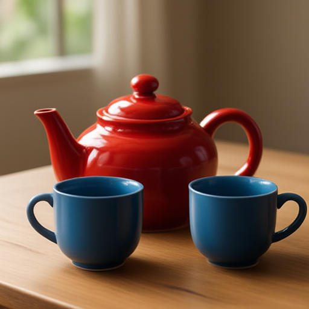
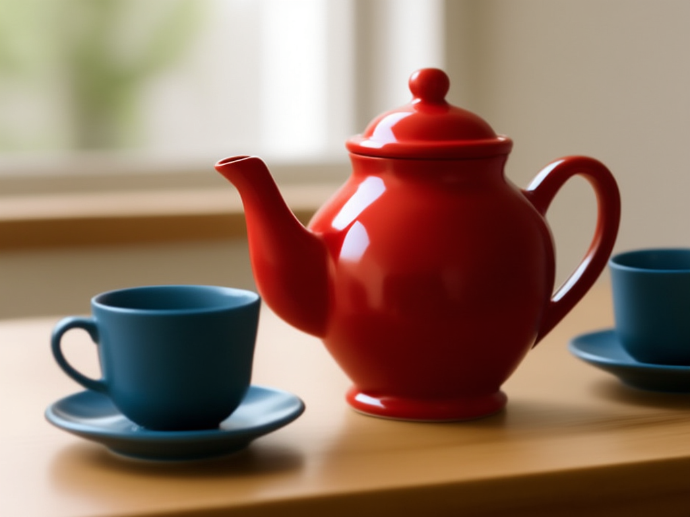

# Ovis-Image HSDP validation

Contributor: 0z5a. Tracks vllm-project/vllm-omni#1217, task E1.

## Configuration

Two NVIDIA L20 GPUs (46,068 MiB each, PCIe PIX), BF16, eager, FlashAttention,
CFG=2, seed 142, guidance 4, 30 steps, complete model inputs and outputs.
Model: `ATH-MaaS/Ovis-Image-7B` at `41be1c5821a92c970d63d7eb595a2fd3fe32b22e`.
Baseline: `232dbc82f8fcb6cb698860b0210b47d60a13ebdc`.
Runtime patch: `6eb8578ffe905ce13f721dcb7b357c39809f203d`.

PyTorch 2.13.0+cu130, vLLM 0.29.0, Diffusers 0.40.0, Transformers 5.14.1,
driver 595.91.07. Other GPUs on the host were active.

## Reproduce

Run `benchmark.py` from a baseline checkout, then a patched checkout. Each
invocation starts a new engine and all workers. Use A0, P0, P1, A1 order.

```bash
CUDA_VISIBLE_DEVICES=4,5 OMP_NUM_THREADS=4 PYTHONPATH="$PWD" \
  python /path/to/benchmark.py --model /path/to/model --output /path/to/A0
CUDA_VISIBLE_DEVICES=4,5 OMP_NUM_THREADS=4 PYTHONPATH="$PWD" \
  python /path/to/benchmark.py --model /path/to/model --output /path/to/P0 --hsdp
```

`run_quartet.sh` preserves the exact host invocation and cache policy.
`check_sharding.py` is a two-rank tiny-model correctness probe, separate from
full-model E2E. Run it with `torchrun --standalone --nproc_per_node=2`.
`analyze.py` requires all four completed arms.

## Images

Prompt: A red ceramic teapot beside two blue cups on a wooden table, soft daylight.
Negative prompt: blurry, distorted.

| Resolution | Baseline | HSDP |
|---|---|---|
| 512 x 512 |  |  |
| 1024 x 768 |  |  |

The paired images have identical SHA-256 hashes. All 56 generated images were checked.

## Test results

| Resolution | Baseline latency (s) | HSDP latency (s) | Speedup | Speed change | Max pixel difference |
|---|---:|---:|---:|---:|---:|
| 512×512 | 4.486 [4.450–4.643] | 32.789 [32.707–36.135] | 0.137× | -86.32% | 0 / 255 |
| 1024×768 | 12.110 [12.045–12.953] | 40.516 [40.294–65.764] | 0.299× | -70.11% | 0 / 255 |

Latency is the geometric mean of two fresh-process medians; brackets contain the range of all 10 measured requests per configuration/resolution. Speedup = baseline latency / HSDP latency. Negative speed change means slower. All 56 images (including warmups) are pixel-identical to their same-resolution baseline.

| Memory metric | Baseline | HSDP |
|---|---:|---:|
| Process-scoped memory after loading, each rank (both starts) | 17.43 GiB | 10.68 GiB (-38.73%) |
| First start: max sampled device-wide memory (either rank) | 43,896 MiB | 45,398 MiB |
| Second start: max sampled device-wide memory (either rank) | 21,788 MiB | 16,850 MiB |

Device-wide maxima include the complete startup/request/shutdown window, sampled every second. They are not per-process allocator peaks. Report the startup-dependent variation as measured; lower post-load residency does not establish a lower worst-case peak.

| Arm | Controller PID | Initialization (s) | 512×512 median (s) | 1024×768 median (s) |
|---|---:|---:|---:|---:|
| A0 | 2798701 | 24.088 | 4.471 | 12.100 |
| P0 | 2817380 | 195.451 | 32.756 | 40.463 |
| P1 | 2904165 | 167.386 | 32.822 | 40.569 |
| A1 | 2990465 | 39.877 | 4.501 | 12.120 |

25 focused tests passed; 1 advanced test was deselected. The new regression fails on baseline and passes on the patch. Two-rank small-model forward equality and all applicable changed-file pre-commit checks passed.

One fresh quartet, eager, batch/concurrency 1, one prompt and two resolutions. Other GPUs on the host were active. No statistical confidence or serving-throughput claim. Full weights and source hashes are supplied.

